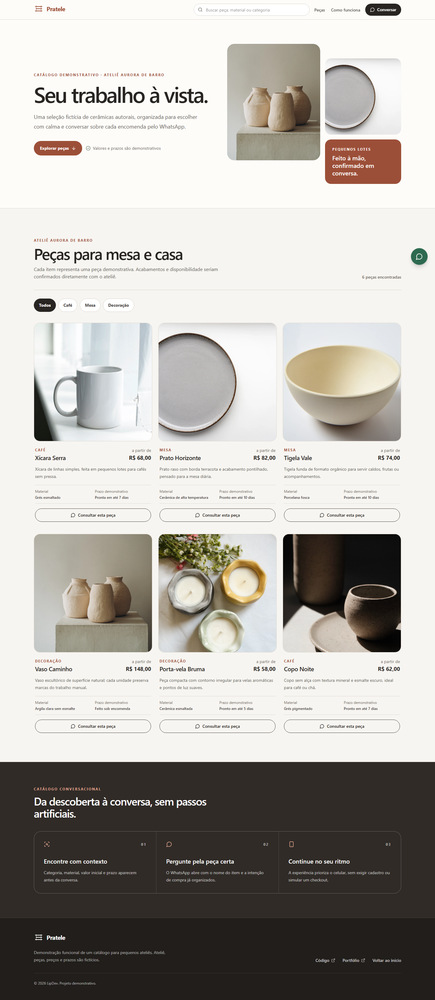

# Pratele

> Seu trabalho à vista.

Pratele é uma demonstração funcional de catálogo conversacional para pequenos ateliês, artesãos e estúdios de produtos sob encomenda. A experiência ajuda visitantes a encontrar uma peça, entender material e prazo e iniciar uma conversa contextualizada pelo WhatsApp.

[](https://pratele.vercel.app/)
[](https://github.com/LipDev-sudo/pratele/actions/workflows/ci.yml)
[](https://lipdev.vercel.app/)



## Posicionamento

- **Público:** pequenos ateliês, profissionais independentes e negócios de produtos autorais.
- **Fluxo principal:** busca ou filtro → leitura dos detalhes → consulta contextual pelo WhatsApp.
- **Diferencial:** apresentação leve para vendas por conversa, sem simular checkout, estoque ou estrutura de marketplace.
- **Demonstração:** o Ateliê Aurora de Barro, seus produtos, preços e prazos são inteiramente fictícios.

## O que funciona

- busca sem distinção de acentos;
- filtros por categoria;
- catálogo responsivo com informações de material e prazo;
- links de WhatsApp preenchidos para cada produto;
- estados vazios e navegação por teclado;
- metadata, Open Graph, favicon, robots e sitemap;
- testes unitários, E2E e auditoria automatizada de acessibilidade.

## Stack

React 18, TypeScript, Vite, Tailwind CSS, Vitest, Playwright e Axe.

## Executar localmente

```bash
npm ci
npm run dev
```

Validação completa:

```bash
npm run typecheck
npm run lint
npm test
npm run build
npm run test:e2e
npm audit
```

## Limites da demonstração

- não há backend, autenticação, checkout ou sincronização de estoque;
- o WhatsApp é aberto sem número predefinido;
- nenhuma métrica, avaliação, cliente ou resultado comercial é apresentado como real;
- as fotografias de apoio são provenientes do [Unsplash](https://unsplash.com/) e representam o catálogo fictício.

## Autoria

Desenvolvido por [Hamilton Felipe Soares da Silva](https://www.linkedin.com/in/hamilton-felipe-875054383/). Veja outros projetos no [portfólio](https://lipdev.vercel.app/).

Licenciado sob a [MIT License](LICENSE).
